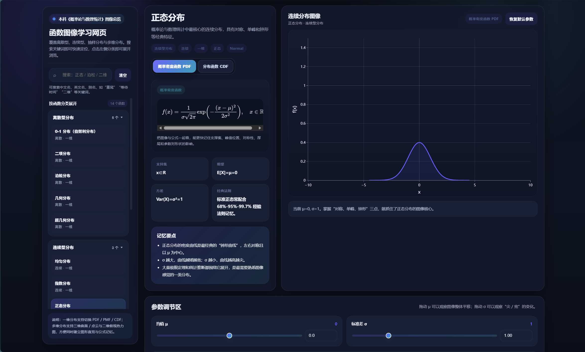
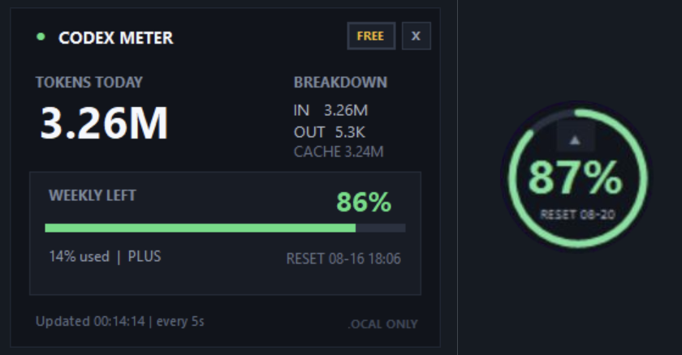

# 👋 你好，我是 Flowstate

> M(aterials)SE@SCUT｜还在直面学业。｜Work For Non-profit Impacts

对一切可视化的东西感兴趣，持续把想法变成可以分享的作品。

## 🔭 最近在关注

- AI for Materials
- Python 与科学计算
- 线性代数、概率统计的可视化表达
- 如何更高效地使用 AI 辅助学习与开发

## 🧪 一些项目

### [probability-statistics-function-gallery](https://github.com/yizhengarcanelec/probability-statistics-function-gallery)

一个围绕概率、统计与常见函数的可视化网页，希望更直观展示参数调节对变量的影响（趋势）

### [codex-usage-widget](https://github.com/yizhengarcanelec/codex-usage-widget)

一个实时展示 Codex Tokens用量的小组件，强迫症主要是

  
  

## 🌱 正在成长

未来想干啥还在想

如果你有任何 Knowledge 轻量可视化的 idea，千万联系！

## 📫 联系我
yizheng.arcanelec@gmail.com

  

